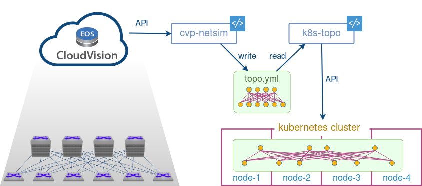

# cvp-netsim
A script that creates k8s-topo (and docker-topo) compliant topology and configuration files (artefacts) based on the information extracted from Arista CloudVision Portal (CVP)



## Installation

No installation needed, just clone this repository

```bash
git clone https://github.com/networkop/cvp-netsim.git && cd cvp-netsim
```

## Usage

```
./ingest.py -h
usage: ingest.py [-h] [-d] [-i] [-f FILTER] [-v] cvp user pwd

Tool to ingest topology information from CVP

positional arguments:
  cvp                   CVP address
  user                  CVP username
  pwd                   CVP password

optional arguments:
  -h, --help            show this help message and exit
  -d, --debug           Enable Debug
  -i, --ignore          Ignore 3rd party devices
  -f FILTER, --filter FILTER
                        Match specified string in hostnames
  -v, --veos            Produce artefacts for vEOS
```

## Example 1

Create artefacts for cEOS-based topology

```
/ingest.py localhost:9443 cvpadmin cvpadmin1
```

## Example 2

Create artefacts for vEOS-based topology only for devices that have "dc1" in their hostname

```
./ingest.py -f dc1 -v localhost:9443 cvpadmin cvpadmin1
```

## How to use with k8s-topo

> Assuming that the kubernetes cluster already has [meshnet-cni][meshnet] and [k8s-topo][k8s-topo] installed

Copy the archived artefacts to the machine with k8s cluster credentials

```
scp cvp_topology.tar.gz k8s-lab-node-1:/home/core
```

Copy the artefacts into the `k8s-topo` pod

```
kubectl cp /home/core/cvp_topology.tar.gz k8s-topo:/
```

From inside the `k8s-topo` pod, extract the artefacts into a dedicated directory

```
rm -rf ./lab && mkdir -p ./lab
tar zxvf /cvp_topology.tar.gz -C lab
```

Assuming the required docker image is already [uploaded to docker registry][veos-image], update the custom image mapping to chose the correct docker image based on a common string in devices hostnames

```
grep -A 1 custom_image lab/cvp_topology.yml 
custom_image:
  dc1: "10.1.1.1:5000/veos:latest"
```

Otherwise, to use cEOS, set the `CEOS_IMAGE` environment variable (also assuming the image has been [pre-uploaded][ceos-image]):

```
export CEOS_IMAGE=$(kubectl get service docker-registry -o json | jq -r '.spec.clusterIP'):5000/ceos:4.21.5F
```

Create the topology with `k8s-topo`

```
./bin/k8s-topo --create lab/cvp_topology.yml 
INFO:__main__:All data has been uploaded to etcd
INFO:__main__:All pods have been created successfully
```

Check that devices have been created

```
kubectl get pods
NAME                                      READY   STATUS    RESTARTS   AGE
etcd0                                     1/1     Running   0          2d12h
etcd1                                     1/1     Running   0          2d12h
etcd2                                     1/1     Running   0          2d12h
internal-docker-registry-7999859b-fm22v   1/1     Running   0          2d12h
k8s-topo                                  1/1     Running   0          2d12h
acme-dc1b2001-a                           1/1     Running   0          3m27s
acme-dc1b2001-b                           1/1     Running   0          3m27s
acme-dc1l3001-a                           1/1     Running   0          3m29s
acme-dc1l3001-b                           1/1     Running   0          3m28s
acme-dc1l3002-a                           1/1     Running   0          3m31s
acme-dc1l3002-b                           1/1     Running   0          3m27s
acme-dc1l3003-a                           1/1     Running   0          3m31s
acme-dc1l3003-b                           1/1     Running   0          3m27s
acme-dc1l3004-a                           1/1     Running   0          3m30s
acme-dc1l3004-b                           1/1     Running   0          3m29s
acme-dc1l3005-a                           1/1     Running   0          3m31s
acme-dc1l3005-b                           1/1     Running   0          3m30s
acme-dc1l3006-a                           1/1     Running   0          3m30s
acme-dc1l3006-b                           1/1     Running   0          3m31s
acme-dc1l3007-a                           1/1     Running   0          3m28s
acme-dc1l3007-b                           1/1     Running   0          3m31s
acme-dc1l3008-a                           1/1     Running   0          3m31s
acme-dc1l3008-b                           1/1     Running   0          3m30s
acme-dc1l3009-a                           1/1     Running   0          3m29s
acme-dc1l3009-b                           1/1     Running   0          3m30s
acme-dc1l3010-a                           1/1     Running   0          3m31s
acme-dc1l3010-b                           1/1     Running   0          3m30s
acme-dc1l3011-a                           1/1     Running   0          3m27s
acme-dc1l3011-b                           1/1     Running   0          3m29s
acme-dc1l3012-a                           1/1     Running   0          3m31s
acme-dc1l3012-b                           1/1     Running   0          3m31s
acme-dc1l3013-a                           1/1     Running   0          3m30s
acme-dc1l3013-b                           1/1     Running   0          3m31s
acme-dc1l3014-a                           1/1     Running   0          3m30s
acme-dc1l3014-b                           1/1     Running   0          3m28s
acme-dc1l3015-a                           1/1     Running   0          3m31s
acme-dc1l3015-b                           1/1     Running   0          3m28s
acme-dc1l3016-a                           1/1     Running   0          3m30s
acme-dc1l3016-b                           1/1     Running   0          3m29s
acme-dc1l3017-a                           1/1     Running   0          3m31s
acme-dc1l3017-b                           1/1     Running   0          3m29s
acme-dc1l3018-a                           1/1     Running   0          3m30s
acme-dc1l3018-b                           1/1     Running   0          3m29s
acme-dc1l3019-a                           1/1     Running   0          3m31s
acme-dc1l3019-b                           1/1     Running   0          3m31s
acme-dc1l3020-a                           1/1     Running   0          3m30s
acme-dc1l3020-b                           1/1     Running   0          3m28s
acme-dc1l3021-a                           1/1     Running   0          3m27s
acme-dc1l3021-b                           1/1     Running   0          3m30s
acme-dc1l3022-a                           1/1     Running   0          3m31s
acme-dc1l3022-b                           1/1     Running   0          3m27s
acme-dc1l3023-a                           1/1     Running   0          3m31s
acme-dc1l3023-b                           1/1     Running   0          3m28s
acme-dc1l3024-a                           1/1     Running   0          3m31s
acme-dc1l3024-b                           1/1     Running   0          3m31s
acme-dc1l3025-a                           1/1     Running   0          3m28s
acme-dc1l3025-b                           1/1     Running   0          3m27s
acme-dc1l3026-a                           1/1     Running   0          3m27s
acme-dc1l3026-b                           1/1     Running   0          3m31s
acme-dc1l3027-a                           1/1     Running   0          3m31s
acme-dc1l3028-a                           1/1     Running   0          3m31s
acme-dc1s1001-a                           1/1     Running   0          3m27s
acme-dc1s1001-b                           1/1     Running   0          3m31s
```

Connect to a device:

```
kubectl exec -it acme-dc1s1001-a bash
sh-4.2# telnet localhost 23
Trying 127.0.0.1...
Connected to localhost.
Escape character is '^]'.

acme-dc1s1001-a login: 
```


[meshnet-cni]: https://github.com/networkop/meshnet-cni
[k8s-topo]: https://github.com/networkop/k8s-topo
[veos-image]: https://github.com/networkop/docker-topo/tree/master/topo-extra-files/veos#uploading-to-docker-registry
[ceos-image]: https://github.com/networkop/k8s-topo#private-docker-registry-setup